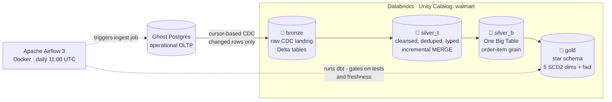
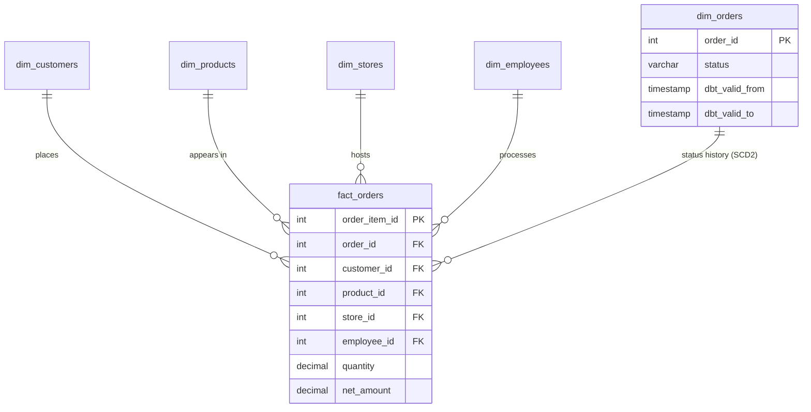
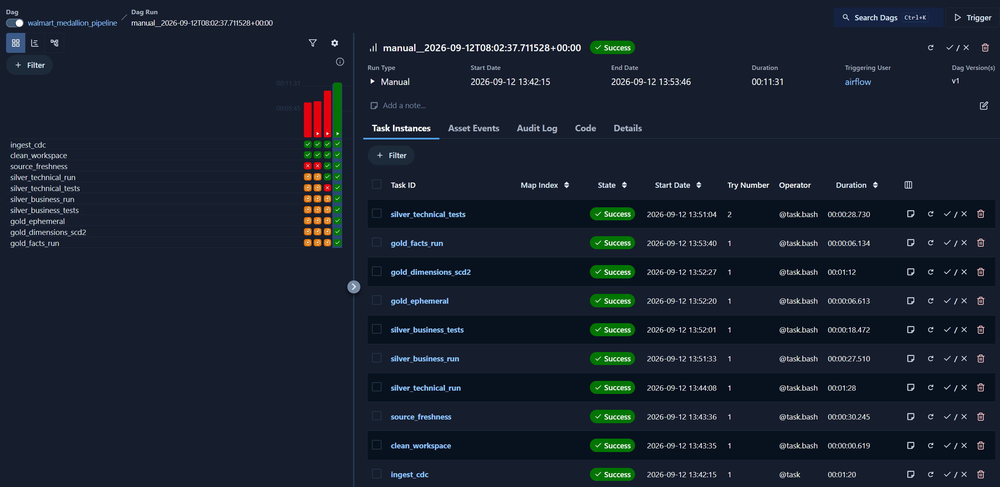

<div align="center">

# Walmart Medallion Lakehouse

**A production-style, end-to-end data platform that moves retail data from an
operational database to an analytics-ready star schema — automatically, every day.**

[](#)
[](#)
[](#)
[](#)
[](#)

*Databricks · dbt · Apache Airflow · Delta Lake · Change Data Capture · Slowly Changing Dimensions*

🧭 **New here?** Follow the [Learning path](#learning-path-zero-to-end) below —
it walks you through this repository from zero to a running pipeline.

</div>

---

## Overview

This repository implements a complete medallion-architecture lakehouse for a
simulated Walmart retail business. Six operational tables — `customers`,
`orders`, `order_items`, `products`, `employees`, and `stores` — live in a
transactional Postgres database. Every night, an orchestrated pipeline detects
**only the rows that changed**, lands them in a Databricks lakehouse, cleanses
and conforms them through multiple curated layers, and publishes a
dimensional **star schema** that BI tools can query directly.

The project is deliberately built the way a real data team builds: layered
architecture, version-controlled transformations, data quality gates between
layers, environment-driven configuration, and a hardened orchestrator — all
open source, all reproducible from this repository.

## How the pipeline works, end to end

### 1. Source system — operational Postgres

The origin of truth is a hosted **Postgres** database (built on
[Ghost](https://ghost.build), an agentic database — the dataset is a classic
retail schema with orders, line items, customers, products, stores, and
employees). Tables evolve continuously, which is what makes change data capture
necessary: a nightly full reload would be wasteful and slow to scale.

### 2. Ingestion — change data capture into bronze

Rather than copying whole tables, a **Databricks Lakeflow ingestion job** reads
a cursor column (`updated_timestamp`) on each source table and pulls only
new or modified rows into the `bronze` schema of the `walmart` Unity Catalog.
The result is an append-oriented landing zone of Delta tables that preserves
the full change history of the source — cheap to store, replayable, and the
foundation every downstream layer trusts.

### 3. Silver (technical) — one clean version of the truth

Six dbt models (`models/silver_t/`) mirror the bronze tables one-to-one and
apply the unglamorous but critical work of data engineering: explicit type
casts, `trim()`/`lower()` normalization of names and emails, date
standardization, deduplication on business keys (latest record wins), and
business-friendly renaming. Each model is **incremental with a MERGE
strategy** — every run touches only new or changed rows, so cost and runtime
stay flat as history grows.

### 4. Silver (business) — the One Big Table

`models/silver_b/obt_b.sql` joins all six cleansed entities into a single wide
**One Big Table** at order-item grain (300,000+ rows). The OBT pattern trades
storage for simplicity: analysts and ad-hoc queries get every attribute of an
order line — customer, product, store, employee, status, amounts — in one
place, with no join gymnastics. It is built as a full table because the
fan-out join makes incremental bookkeeping more expensive than a rebuild at
this scale.

### 5. Gold — star schema with history-aware dimensions

The serving layer is a classic dimensional model:

- **Dimensions** (`dim_customers`, `dim_products`, `dim_employees`,
  `dim_stores`, `dim_orders`) are built by dbt **snapshots**. When a tracked
  attribute changes (a customer moves, an order status updates), dbt closes the
  old row (`dbt_valid_to`) and inserts a new one — full **SCD Type-2 history**,
  so "what did we know at the time?" is always answerable.
- **`fact_orders`** is an incremental fact table at order-item grain, carrying
  the measures (quantity, prices, amounts) and foreign keys into the
  dimensions.

Ephemeral staging models in `models/gold/ephimeral/` shape the OBT into
dimension-ready inputs; dbt inlines them as CTEs, keeping lineage visible in
the docs without materializing anything.

### 6. Data quality — gates, not suggestions

Quality checks are wired **into the orchestration**, not run as an afterthought:

- **Source freshness** — `dbt source freshness` runs before any transformation.
  If bronze is older than the configured SLA (`SOURCE_FRESHNESS_*_DAYS`
  environment variables), the pipeline stops rather than publish stale data.
- **Generic tests** — `unique`, `not_null`, and business rules (e.g. prices can
  never be negative) attach to silver models in YAML.
- **Singular tests** — cross-model assertions on the OBT (zero-rows-pass
  convention).

Every layer's tests run immediately after that layer's build; a failure halts
the DAG before incorrect data can reach gold.

### 7. Orchestration — Apache Airflow 3 in Docker

`walmart-airflow/dags/orchestrate.py` defines the daily pipeline with the
TaskFlow API. Each stage is its own task, giving per-stage retries, logs, and a
readable graph:

```
ingest_cdc ─▶ clean_workspace ─▶ source_freshness ─▶ silver_technical_run
           ─▶ silver_technical_tests ─▶ silver_business_run
           ─▶ silver_business_tests ─▶ gold_ephemeral
           ─▶ gold_dimensions_scd2 ─▶ gold_facts_run
```

Production hardening details:

| Concern | Implementation |
|---|---|
| Stuck CDC job | `ingest_cdc` polls the Databricks run and enforces a hard `CDC_POLL_TIMEOUT_SECONDS` deadline — the task fails instead of hanging a worker forever |
| Overlapping runs | `max_active_runs=1` + `catchup=False` |
| Transient failures | Automatic retry with backoff via `default_args` |
| Reproducible environment | Custom Airflow image (`Dockerfile`) bakes in dbt and the Databricks SDK; the dbt project is bind-mounted into every container |
| No-overlap scheduling | Daily 11:00 UTC cron, one active run at a time |

### 8. Configuration & security — nothing sensitive in git

Every credential — workspace host, access token, warehouse HTTP path, job ID —
enters through **environment variables**, resolved by `env_var()` in
`profiles.yml` and `os.environ` in the DAG. The real `.env` is git-ignored; the
repository ships `.env.example` documenting every variable. Rotating a token is
a one-file change plus a container restart.

## Architecture

### System flow — source to star schema



### Gold layer — the star schema



*(Diagrams render natively on GitHub. The DAG task graph is in section 7 above;*
*[docs/architecture.md](docs/architecture.md) has the fully annotated version.)*

## Quick start

```bash
git clone https://github.com/<you>/walmart-medallion-lakehouse.git
cd walmart-medallion-lakehouse/walmart-airflow

# 1. Configure — copy the template and fill in Databricks host, token,
#    warehouse HTTP path, and CDC job ID
cp .env.example .env

# 2. Build & launch the platform
docker compose build && docker compose up -d

# 3. Orchestrate — open http://localhost:8080, unpause
#    walmart_medallion_pipeline, and trigger it
```

The complete zero-to-running walkthrough — creating the source database, the
Databricks ingest job, the catalog schemas, and the first run — is in
**[docs/setup-guide.md](docs/setup-guide.md)**.

<details>
<summary><b>Running dbt locally (without Airflow)</b></summary>

dbt auto-loads a `.env` from the working directory:

```powershell
cp walmart-airflow\.env walmart_project\.env
cd walmart_project
dbt debug        # → All checks passed!
dbt run          # silver + gold layers
dbt snapshot     # SCD2 dimensions
dbt docs generate && dbt docs serve
```

</details>

## Repository layout

```
walmart-medallion-lakehouse/
├── walmart_project/            # dbt project
│   ├── models/
│   │   ├── source.yml          #   bronze sources + freshness SLA
│   │   ├── silver_t/           #   6 incremental cleansed models + YAML tests
│   │   ├── silver_b/obt_b.sql  #   One Big Table
│   │   └── gold/               #   ephemeral staging + fact_orders
│   ├── snapshots/              #   SCD2 dimensions (5 snapshots)
│   ├── macros/                 #   generate_schema_name override
│   ├── tests/                  #   singular data tests
│   └── profiles.yml            #   env_var()-only connection
├── walmart-airflow/            # orchestration platform
│   ├── dags/orchestrate.py     #   the pipeline DAG (TaskFlow API)
│   ├── docker-compose.yaml     #   CeleryExecutor stack + dbt bind mount
│   ├── Dockerfile              #   airflow + dbt + databricks-sdk image
│   └── .env.example            #   credential template (real .env git-ignored)
└── docs/                       # seven in-depth guides
```

## Learning path: zero to end

Follow these in order — each step builds on the previous one, taking you from
*"what is this?"* to *"I built, ran, and operate this pipeline myself."*

| Step | Read / do | What you'll learn | Est. time |
|---|---|---|---|
| 1️⃣ | **This README** | The big picture: architecture, layer-by-layer design, why each choice was made | 15 min |
| 2️⃣ | [Architecture deep-dive](docs/architecture.md) | Data flow in detail, medallion design rationale, repo map | 20 min |
| 3️⃣ | [Setup guide](docs/setup-guide.md) | **Hands-on:** build everything from zero — source DB, Databricks catalog & ingest job, `.env`, Docker, first run | 60–90 min |
| 4️⃣ | [dbt guide](docs/dbt-guide.md) | Every model, macro, test, and snapshot in this repo — incremental MERGE, OBT, SCD2, freshness | 30 min |
| 5️⃣ | [Airflow guide](docs/airflow-guide.md) | DAG anatomy, the custom Docker image, operating the platform | 20 min |
| 6️⃣ | [Runbook](docs/runbook.md) | Day-2 operations — and **real** failure cases from this project with their diagnoses | 20 min |
| 7️⃣ | [Security guide](docs/security.md) | Secrets management, token rotation, keeping credentials out of git | 10 min |
| 8️⃣ | [Git guide](docs/git-guide.md) | Release conventions, how this repo is structured for collaboration | 5 min |

> 💡 **Shortcut for the impatient:** run steps 1 → 3 and you'll have the
> pipeline live in your own Databricks workspace; the rest deepens mastery.

## Documentation

| Guide | Contents |
|---|---|
| [Architecture](docs/architecture.md) | Data flow, layer-by-layer design rationale |
| [Setup guide](docs/setup-guide.md) | Zero → running pipeline, step by step |
| [dbt guide](docs/dbt-guide.md) | Every model, macro, test, and snapshot explained |
| [Airflow guide](docs/airflow-guide.md) | DAG anatomy, custom image, platform operations |
| [Runbook](docs/runbook.md) | Monitoring and real troubleshooting cases |
| [Security](docs/security.md) | Secrets management, rotation, git hygiene |
| [Git guide](docs/git-guide.md) | Release conventions and repo naming |

## Sample run

A complete production run — every stage green, from CDC ingestion through the
gold fact build (11m31s end to end):



The grid shows the full task lineage: `ingest_cdc` triggers and waits on the
Databricks job; workspace artifacts are cleaned; source freshness is verified
against the SLA; both silver layers run and pass their tests; ephemeral gold
staging, SCD2 snapshots, and the incremental fact complete the publish.

---

<div align="center">

**Stack:** Databricks (Unity Catalog, Delta Lake, Lakeflow CDC, Serverless SQL) ·
dbt 1.12 + dbt-databricks · Apache Airflow 3.3 (CeleryExecutor) ·
Docker Compose · Ghost Postgres

</div>
